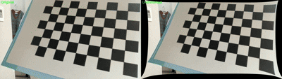
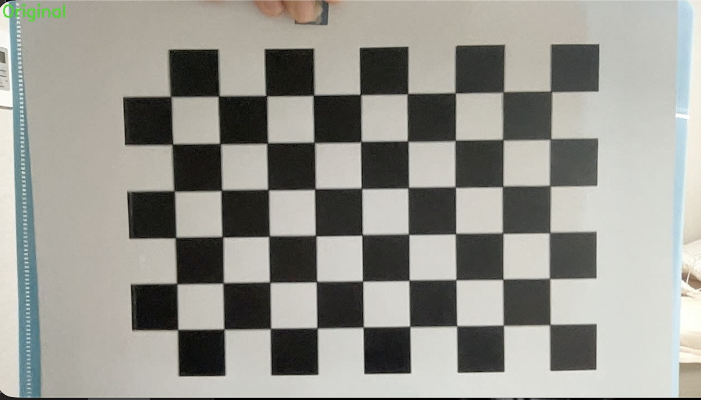
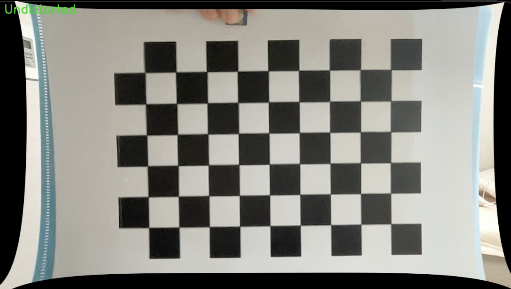

## 1. Project Overview

이 프로젝트는 카메라의 고유 파라미터를 추출하는 **Camera Calibration(카메라 캘리브레이션)**과, 이를 바탕으로 렌즈의 기하학적 왜곡을 해결하는 **Distortion Correction(왜곡 보정)** 과정으로 구성됩니다. 특히 육안으로 식별하기 어려운 미세한 렌즈 왜곡이 알고리즘을 통해 어떻게 정밀하게 보정되는지 분석합니다.

## 2. Camera Calibration Results (카메라 캘리브레이션 결과)

체스판 이미지를 활용하여 얻은 카메라의 내부 파라미터와 왜곡 계수는 다음과 같습니다.

### Intrinsic Parameters (카메라 내부 파라미터 / Camera Matrix)

- **fx (Focal length x):** 984.91
- **fy (Focal length y):** 982.06
- **cx (Principal point x):** 634.68
- **cy (Principal point y):** 348.33

### Distortion Coefficients (왜곡 계수 / dist)

- **Coefficients:** [0.06679, -0.06335, -0.00682, 0.00312, -0.34412]

### Reprojection Error (재투영 오차)

- **RMSE (Root Mean Square Error):** 0.8517
  > **Analysis (분석):** 1.0 미만의 에러율 -> 매우 신뢰도 높은 캘리브레이션 데이터 확보

---

## 3. Lens Distortion Correction Demo (렌즈 왜곡 보정 데모)

### 🎥 Comparison Video (비교 영상)

> 원본 영상 & 보정본 나란히 배치하여 실시간 변화 확인

### 🖼️ Side-by-Side Analysis (보정 전후 비교 분석)

#### Version A: Full Frame Comparison (전체 프레임 비교)

#### Version B: Checkerboard Center Zoom (체스판 중심 확대 비교)

|         Original Checkerboard         |        Undistorted Checkerboard         |
| :-----------------------------------: | :-------------------------------------: |
|  |  |

---

## 4. Distortion Analysis: Center vs. Edge (왜곡 분석: 중심부 vs 가장자리)

보정된 영상에서 테두리가 곡선으로 변하고, 렌즈의 물리적 특성을 수학적으로 평탄화하는 과정에서 발생되는 검은색 영역

#### 1) Center Part Distortion (중심부 왜곡)

- **Characteristic (특징):** 렌즈의 중앙부는 빛의 굴절이 가장 적음
- **Analysis (분석):** 보정 전후를 비교해도 체스판 격자의 크기나 직선 정도에 큰 변화 없음 -> 렌즈 중심의 투영 모델이 이미 실제 세계와 매우 유사함(큰 굴절 존재 X)

#### 2) Edge Part Distortion (가장자리 왜곡)

- **Characteristic (특징):** 렌즈의 끝부분으로 갈수록 빛이 크게 굴절되는 **Barrel Distortion(배럴 왜곡)** 발생
- **Analysis (분석):** 알고리즘은 안으로 굽은 선들을 팽팽하게 밖으로 당겨 직선으로 flat
  - **Curved Borders (곡선 테두리):** 구석의 픽셀들이 바깥으로 밀려나가며 곡선 형태의 테두리 형성
  - **Invalid Regions (검은색 영역):** 픽셀이 밀려나며 생긴 빈 공간은 검은색 영역 발생

결과적으로, 보정된 영상은 육안으로 보기에 테두리가 휘어 보일 수 있으나, **격자무늬의 기하학적 직선성(Geometric Linearity)**은 수학적으로 훨씬 더 완벽하게 복원된 상태!

---

## 5. How to Run (실행 방법)

1. **`camera_calibration.py`를 실행**하여 다양한 각도에서 체스판 이미지를 캡처(15장 이상)
2. 생성된 **`calibration_data.npz` 파일을 확인**하여 파라미터가 정상적으로 저장되었는지 확인
3. **`distortion_correction.py`를 실행**하여 실시간으로 왜곡이 보정되는 영상 확인 -> `corrected_video.mp4`로 저장
