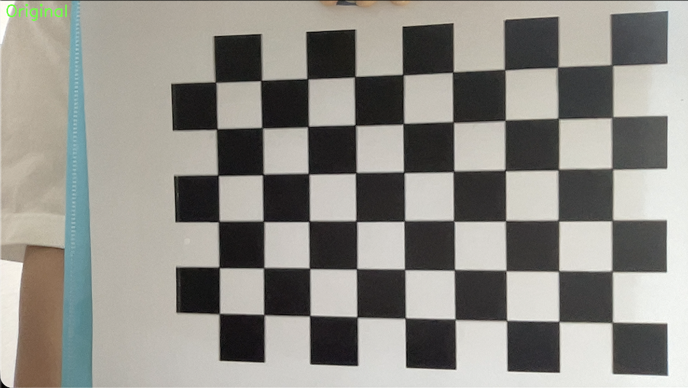
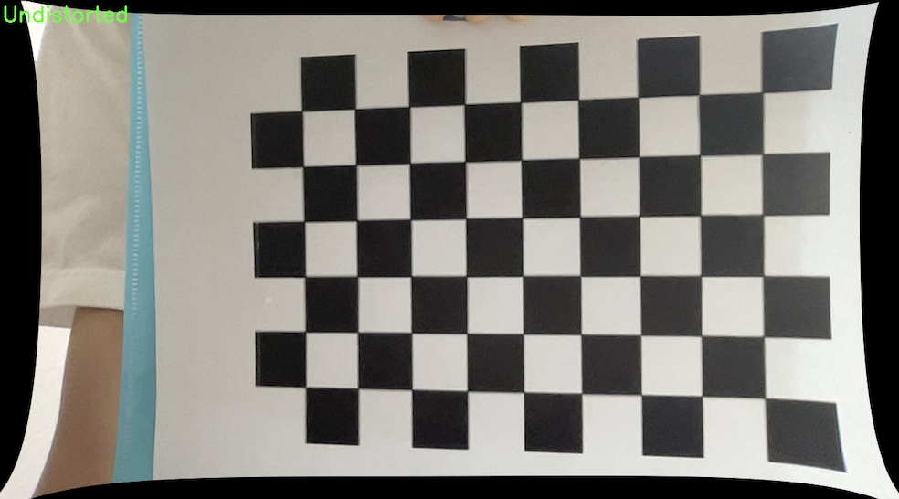

## 1. Project Overview

이 프로젝트는 카메라의 고유 파라미터를 추출하는 **Camera Calibration**과, 이를 바탕으로 렌즈의 기하학적 왜곡을 해결하는 **Distortion Correction** 과정으로 구성됩니다. 특히 광각 렌즈에서 발생하는 배럴 왜곡(Barrel Distortion)을 효과적으로 보정합니다.

## 2. Camera Calibration Results

체스판 이미지를 활용하여 얻은 카메라의 내부 파라미터는 다음과 같습니다.

### Intrinsic Parameters (Cemera Matrix)

- **fx (Focal length x):** 984.91
- **fy (Focal length y):** 982.06
- **cx (Principal point x):** 634.68
- **cy (Principal point y):** 348.33

### Distortion Coefficients (dist)

- **Coefficients:** [0.06679, -0.06335, -0.00682, 0.00312, -0.34412]

### Reprojection Error

- **RMSE (Root Mean Square Error):** 0.8517
  > **결과 분석:** 1.0 미만의 오차율을 기록하여 매우 높은 신뢰도의 캘리브레이션 데이터를 확보하였습니다.

---

## 3. Lens Distortion Correction Demo

웹캠을 통해 실시간으로 왜곡을 보정한 결과입니다.

### Distortion Correction Side-by-Side

|       Original Video        |         Undistorted Video         |
| :-------------------------: | :-------------------------------: |
|  |  |

## 4. How to Run

1. `camera_calibration.py`를 실행하여 다양한 각도에서 체스판을 15장 이상 캡처합니다.
2. 생성된 `calibration_data.npz` 파일을 확인합니다.
3. `distortion_correction.py`를 실행하여 보정된 실시간 영상을 확인하고 녹화합니다.
